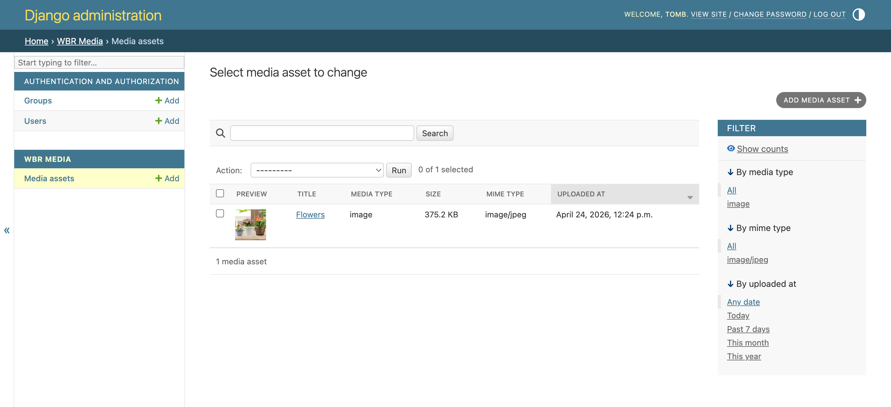
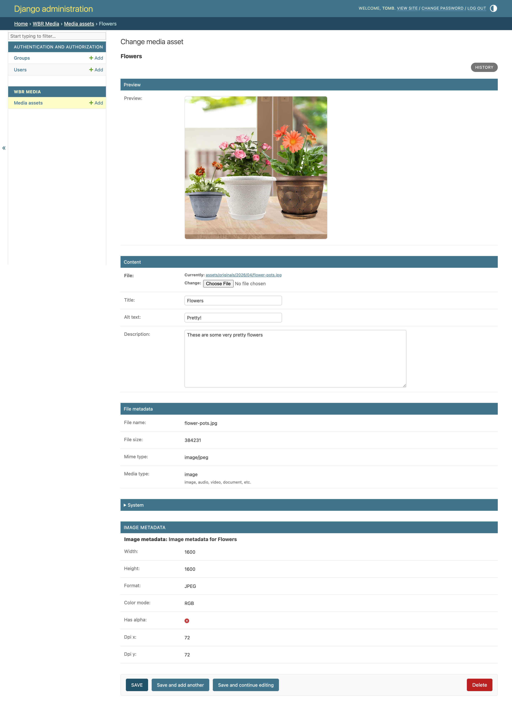

# WBR Media


Portable media infrastructure for Django.

`wbr_media` provides a clean, consistent way to store, manage, render, and now **port media assets between Django installations** without requiring a full CMS.

---

# 📷 Screenshots

## Media Index

A lightweight media library view with previews and metadata.



## Media Detail

Asset inspection with preview, metadata, and image properties.



---

# Why WBR Media?

Django provides excellent support for uploading files, but it intentionally leaves higher-level media management to individual applications.

`wbr_media` fills that gap by providing:

- structured media storage
- automatic metadata extraction
- consistent template rendering
- safe file lifecycle management
- complete import/export portability

without introducing the complexity of a full content management system.

---

# Why not just use Django FileField?

You certainly can—but most projects eventually end up rebuilding the same infrastructure:

- metadata extraction
- image dimension detection
- MIME type detection
- cleanup of replaced files
- cleanup of deleted files
- rendering helpers
- import/export tooling

`wbr_media` packages those capabilities into a small, reusable application.

---

# ✨ Features

- Structured `MediaAsset` model
- Automatic file metadata extraction
- Image-specific metadata (dimensions, format, alpha, DPI)
- Safe file replacement and deletion
- Flexible template rendering
- Media portability with checksum validation
- Complete export/import workflow for media libraries

---

# 📸 Rendering Media

Load the template tags:

```django

```

Render using the default presentation:

```django

```

Or customize the presentation:

```django

```

## Optional Arguments

| Argument | Description |
|----------|-------------|
| `size` | Named size (currently returns the original file) |
| `display` | `figure` (default for images), `bare`, or `link` (default for non-images) |
| `class_name` | CSS class applied to the rendered element |

---

# 🚀 Installation

```bash
pip install -e .
```

Add the application:

```python
INSTALLED_APPS = [
    ...
    "wbr_media",
]
```

Configure the upload location.

> **Note:** The configured upload path is appended to Django's `MEDIA_ROOT`.

```python
WBR_MEDIA = {
    "UPLOAD_TO": "wbr_media/%Y/%m/",
}
```

Run migrations:

```bash
python manage.py migrate
```

---

# ⚙️ Configuration

Available settings:

```python
WBR_MEDIA = {
    "UPLOAD_TO": "assets/originals/%Y/%m/",
}
```

---

# 📦 Media Portability

One of the primary goals of `wbr_media` is complete portability.

A media library consists of two distinct pieces:

- Media metadata stored in the database
- Physical media files stored on disk

`wbr_media` exports and restores both as a single portable bundle.

## Exporting a Media Library

Create a complete export:

```bash
python manage.py export_wbr_media --output ./backups/wbr_media_export.zip
```

The export process:

1. Exports all `MediaAsset` and `ImageMetadata` records.
2. Copies physical media assets.
3. Generates a manifest describing every exported file.
4. Calculates SHA-256 checksums for each asset.
5. Validates the completed archive.
6. Produces a portable bundle.

## Bundle Layout

```
wbr_media_export.zip
├── data.json
└── media_export.zip
    ├── media_manifest.json
    └── files/
```

The media manifest records:

- exported file path
- existence
- file size
- SHA-256 checksum

These checksums are verified before any restore operation proceeds.

---

## Importing a Media Library

Restore a previously exported bundle:

```bash
python manage.py import_wbr_media ./backups/wbr_media_export.zip
```

The import process:

1. Opens the bundle.
2. Validates the manifest.
3. Verifies SHA-256 checksums.
4. Restores physical media assets.
5. Restores media database records.

If validation fails, restoration is aborted before modifying the destination installation.

---

## Low-Level Commands

The application also exposes lower-level commands for working directly with physical media.

Export physical assets:

```bash
python manage.py export_media_files --output ./exports/media
```

Inspect a media archive:

```bash
python manage.py inspect_media_import ./exports/media_export.zip
```

Restore physical assets:

```bash
python manage.py restore_media_files ./exports/media_export.zip
```

These commands are primarily intended for development, debugging, and testing. In most cases, `export_wbr_media` and `import_wbr_media` should be preferred.

---

# 🧪 Development

A demo project is included.

```bash
cd demo
python manage.py runserver
```

Visit:

```
http://127.0.0.1:8000/media-demo/
```

## Testing

Run the complete test suite:

```bash
pytest
```

---

# 📦 What This Is

- A lightweight media layer for Django
- Consistent media metadata management
- Flexible template rendering
- Safe file lifecycle management
- Portable media transfer between installations

---

# 🚫 What This Is Not

- A CMS
- A digital asset management system
- A replacement for WordPress or Drupal
- A complete media workflow solution

`wbr_media` is intentionally focused on providing a clean infrastructure layer that can be integrated into larger Django applications.

---

# 🛣️ Roadmap

Future improvements include:

- Generated image renditions
- Pluggable storage backends
- Media usage tracking
- Project-specific rendering extensions

The project intentionally avoids becoming a full CMS.

---

## 📄 License

MIT License.