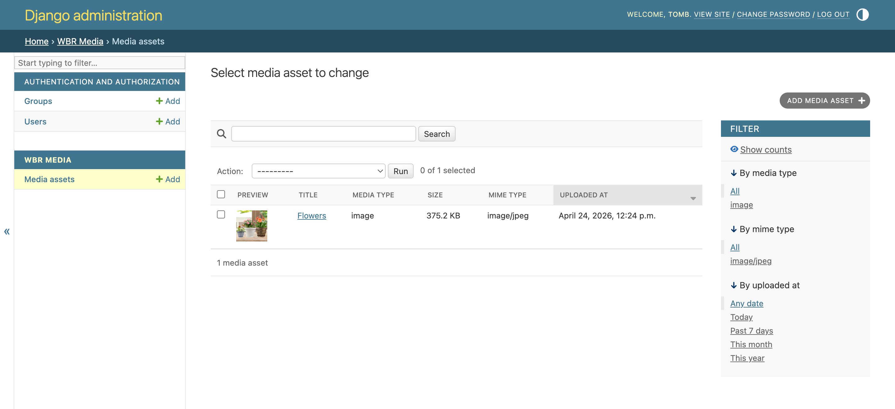
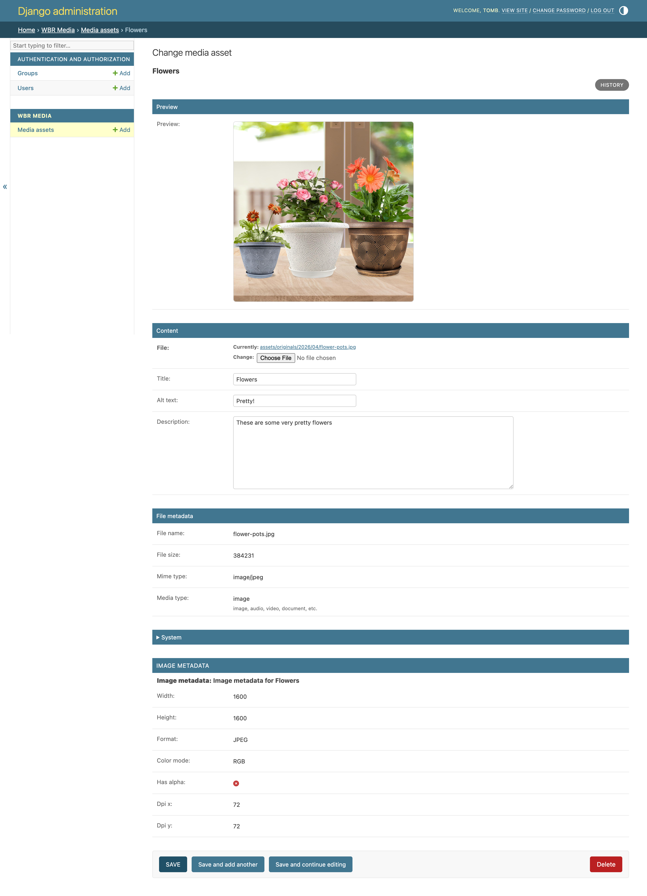

# WBR Media


Portable media infrastructure for Django.

`wbr_media` provides a clean, consistent way to store, manage, render, and now **port media assets between Django installations** without requiring a full CMS.

---

# Why WBR Media?

Django provides excellent support for uploading files, but it intentionally leaves higher-level media management to individual applications.

`wbr_media` fills that gap by providing:

- structured media storage
- automatic metadata extraction
- consistent template rendering
- safe file lifecycle management
- complete import/export portability

without introducing the complexity of a full content management system.

---

# Why not just use Django FileField?

You certainly can—but most projects eventually end up rebuilding the same infrastructure:

- metadata extraction
- image dimension detection
- MIME type detection
- cleanup of replaced files
- cleanup of deleted files
- rendering helpers
- import/export tooling

`wbr_media` packages those capabilities into a small, reusable application.

---

# ✨ Features

- Structured `MediaAsset` model
- Automatic file metadata extraction
- Image-specific metadata (dimensions, format, alpha, DPI)
- Safe file replacement and deletion
- Flexible template rendering
- Media portability with checksum validation
- Complete export/import workflow for media libraries

---

# 📷 Screenshots

## Media Index

A lightweight media library view with previews and metadata.



## Media Detail

Asset inspection with preview, metadata, and image properties.



---

# 📸 Rendering Media

Load the template tags:

```django

```

Render using the default presentation:

```django

```

Or customize the presentation:

```django

```

## Optional Arguments

| Argument | Description |
|----------|-------------|
| `size` | Named size (currently returns the original file) |
| `display` | `figure` (default for images), `bare`, or `link` (default for non-images) |
| `class_name` | CSS class applied to the rendered element |

---

# 🚀 Installation

```bash
pip install -e .
```

Add the application:

```python
INSTALLED_APPS = [
    ...
    "wbr_media",
]
```

Run migrations:

```bash
python manage.py migrate
```

---

# ⚙️ Configuration

The configured upload path is appended to Django's `MEDIA_ROOT`.

Available settings include the upload path and named image profiles:

```python
WBR_MEDIA = {
    "UPLOAD_TO": "assets/originals/%Y/%m/",
    "IMAGE_PROFILES": {
        "thumbnail": {
            "width": 360,
            "height": 640,
            "fit": "crop",
            "position": "center",
        },
        "card": {
            "width": 640,
            "height": 360,
            "fit": "crop",
            "position": "center",
        },
    },
}
```

## Image profiles

Image profiles define named renditions that can be generated from uploaded
images. A profile must provide positive `width` and `height` values in output
pixels.

Supported profile options are:

| Option | Description |
|--------|-------------|
| `width` | Target width in output pixels. |
| `height` | Target height in output pixels. |
| `fit` | `crop`, `scale`, or `contain`; defaults to `crop`. |
| `position` | Crop position or focal point, such as `center` or `top`. |
| `format` | Optional output format. |
| `quality` | Optional encoder quality from 1 to 100. |
| `upscale` | Whether smaller source images may be enlarged. |
| `version` | Optional profile version for invalidating older renditions. |

The fit modes have different results:

- `crop` fills the target box and trims overflow, producing exactly the
  configured dimensions.
- `scale` preserves the complete image within the configured bounds, so the
  actual output dimensions may be smaller than the requested dimensions.
- `contain` preserves the complete image within an exact canvas and may leave
  empty space.

The requested profile dimensions and the actual generated dimensions should be
tracked separately. DPI is preserved as image metadata but does not determine
thumbnail dimensions for web display.

Profile configuration is checked by Django's system-check framework. Invalid
dimensions and unsupported values produce errors. Exact duplicate profiles
produce warnings because they may generate redundant files, but they are not
configuration errors.

---

# 📦 Media Portability

One of the primary goals of `wbr_media` is complete portability.

A media library consists of two distinct pieces:

- Media metadata stored in the database
- Physical media files stored on disk

`wbr_media` exports and restores both as a single portable bundle.

## Exporting a Media Library

Create a complete export:

```bash
python manage.py export_wbr_media --output ./backups/wbr_media_export.zip
```

The export process:

1. Exports all `MediaAsset` and `ImageMetadata` records.
2. Copies physical media assets.
3. Generates a manifest describing every exported file.
4. Calculates SHA-256 checksums for each asset.
5. Validates the completed archive.
6. Produces a portable bundle.

## Bundle Layout

```
wbr_media_export.zip
├── data.json
└── media_export.zip
    ├── media_manifest.json
    └── files/
```

The media manifest records:

- exported file path
- existence
- file size
- SHA-256 checksum

These checksums are verified before any restore operation proceeds.

---

## Importing a Media Library

Restore a previously exported bundle:

```bash
python manage.py import_wbr_media ./backups/wbr_media_export.zip
```

The import process:

1. Opens the bundle.
2. Validates the manifest.
3. Verifies SHA-256 checksums.
4. Restores physical media assets.
5. Restores media database records.

If validation fails, restoration is aborted before modifying the destination installation.

## Scoped Exports

Exports can be limited to a caller-selected collection of `MediaAsset` records. The
host application owns the selection rules; WBR Media does not inspect site IDs,
host models, or multisite relationships.

Pass either a `QuerySet` or an iterable of `MediaAsset` objects to the export APIs:

```python
from wbr_media.models import MediaAsset
from wbr_media.transfer import MediaFileExporter, WBRMediaHandler

assets = MediaAsset.objects.filter(title__startswith="Campaign")

data = WBRMediaHandler().export_data(assets=assets)
MediaFileExporter(
    site=None,
    output_dir="./exports/media",
    assets=assets,
).run()
```

For a combined export, resolve the selection once and pass that same collection to
both metadata and file export steps. This guarantees that `data.json` and the
physical-file archive contain the same assets:

```python
assets = list(MediaAsset.objects.filter(title__startswith="Campaign").order_by("file"))

data = WBRMediaHandler().export_data(assets=assets)
media_result = MediaFileExporter(
    site=None,
    output_dir="./exports/media",
    assets=assets,
).run()
```

When `assets` is omitted, the existing behavior is preserved and all media assets
are exported.

---

## Low-Level Commands

The application also exposes lower-level commands for working directly with physical media.

Export physical assets:

```bash
python manage.py export_media_files --output ./exports/media
```

Inspect a media archive:

```bash
python manage.py inspect_media_import ./exports/media_export.zip
```

Restore physical assets:

```bash
python manage.py restore_media_files ./exports/media_export.zip
```

These commands are primarily intended for development, debugging, and testing. In most cases, `export_wbr_media` and `import_wbr_media` should be preferred.

---

# 🧪 Development

A demo project is included.

```bash
cd demo
python manage.py runserver
```

Visit:

```
http://127.0.0.1:8000/media-demo/
```

## Testing

Run the complete test suite:

```bash
python -m pytest -q -W error
```

## Validation checks

Install the development and test tools from the repository root:

```bash
python -m pip install -e ".[dev,test]"
```

Run the same quality and package checks used by pull-request CI:

```bash
python -m ruff check .
python -m ruff format --check .
python -m pytest -q -W error
python -m build --outdir dist
python -m twine check --strict dist/*
python scripts/validate_distribution.py dist
python scripts/validate_installation.py dist
```

Run the dependency audit separately:

```bash
python -m pip install -e ".[security]"
python -m pip check
python -m pip uninstall --yes wbr-media
python -m pip_audit --local --strict --progress-spinner off
```

Run the repository secret scan with Docker:

```bash
docker run --rm \
  --volume "$PWD:/repo" \
  zricethezav/gitleaks:v8.24.2 \
  detect --source=/repo --no-banner --redact --exit-code 1
```

GitHub Actions runs these checks for pushes and pull requests. Dependabot
checks Python and GitHub Actions dependencies weekly. See
[`docs/releasing.md`](docs/releasing.md) for release gates and publishing.

---

# 📦 What This Is

- A lightweight media layer for Django
- Consistent media metadata management
- Flexible template rendering
- Safe file lifecycle management
- Portable media transfer between installations

---

# 🚫 What This Is Not

- A CMS
- A digital asset management system
- A replacement for WordPress or Drupal
- A complete media workflow solution

`wbr_media` is intentionally focused on providing a clean infrastructure layer that can be integrated into larger Django applications.

---

# 🛣️ Roadmap

Future improvements include:

- Generated image renditions
- Pluggable storage backends
- Media usage tracking
- Project-specific rendering extensions

The project intentionally avoids becoming a full CMS.

---

## 📄 License

MIT License.
